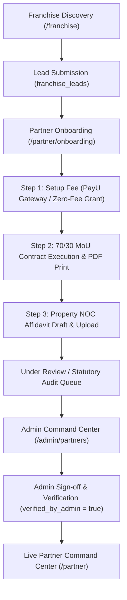

# Comprehensive Platform Workflows & Architecture Walkthrough

This document outlines the complete implementation and audit of all core business processes, automated workflows, and compliance pipelines across Nothingness.

---

## 1. Franchise & Partner Ecosystem



### Key Components:
- **Franchise Discovery & Lead Capture (`app/franchise/page.tsx` & `app/api/franchise/route.ts`)**:
  - Prospective partner lead submission storing to `franchise_leads` table.
  - Automated notification email to the platform expansion team.
  - Immediate transition bridge to legal onboarding.
- **Onboarding Pipeline (`app/partner/onboarding/page.tsx` & `app/api/partner/onboarding/route.ts`)**:
  - Dynamic setup fee lookup (`fee_partner_onboarding` from admin settings).
  - PayU gateway request generation with `action_fee_orders` logging.
  - PayU callback handler ([`app/api/payment/payu-callback/route.ts`](file:///c:/Users/hudav/Documents/GitHub/nothingness/app/api/payment/payu-callback/route.ts)) updating `partner_profiles.setup_fee_paid = true`.
- **Legal Document Generation**:
  - **70/30 Operating MoU ([`components/partner/PartnerMouContractModal.tsx`](file:///c:/Users/hudav/Documents/GitHub/nothingness/components/partner/PartnerMouContractModal.tsx))**:
    - Governed under the Indian Contract Act 1872.
    - 1-click **Print / Save PDF Agreement** (`window.print()`).
    - Cryptographic SHA-256 seal and digital signature logging.
  - **Operational NOC Affidavit ([`components/partner/PropertyNocAffidavitModal.tsx`](file:///c:/Users/hudav/Documents/GitHub/nothingness/components/partner/PropertyNocAffidavitModal.tsx))**:
    - Pre-filled statutory draft with deponent details and property address.
    - Scanned notarized PDF/image upload with auto-provisioning in `partner_properties`.
- **Admin Franchise & Partner Command Center ([`/admin/partners`](file:///c:/Users/hudav/Documents/GitHub/nothingness/app/admin/partners/page.tsx))**:
  - **Inbound Leads Tab**: Status pipeline (`new`, `contacted`, `converted`, `rejected`), 1-click WhatsApp and Email links, delete actions.
  - **Partner Verification Tab**: 3-step compliance indicators, 1-click "View Signed MoU" and "Inspect Affidavit" modals, bank payout details, 1-click **Approve & Activate Host** / **Revoke Verification** buttons.
  - **Sanctuaries & 70/30 Ledger Tab**: Property inventory, space category (Budget vs Luxury), 70% host net / 30% platform split, gated lounge access toggle.
- **Partner Command Center Dashboard ([`/partner`](file:///c:/Users/hudav/Documents/GitHub/nothingness/app/partner/page.tsx))**:
  - Real-time profile, properties, and bookings from Supabase.
  - Verification banner for applications under review.
  - Header actions to inspect executed MoU and NOC affidavits.
  - Real-time payout preference updating with toast confirmation.

---

## 2. Guest Verification & Police Compliance Flow

- **Multi-Channel ID Authentication**:
  - Automated optical AI verification of Aadhaar Card and Passport via Gemini Vision.
  - Anonymous co-guest invite link verification ([`app/verify-guest/invite/page.tsx`](file:///c:/Users/hudav/Documents/GitHub/nothingness/app/verify-guest/invite/page.tsx) & [`app/api/verify-guest/invite/route.ts`](file:///c:/Users/hudav/Documents/GitHub/nothingness/app/api/verify-guest/invite/route.ts)) using `createAdminClient()`.
  - Additional guest tariff settlement via PayU ([`app/api/verify-guest/pay/route.ts`](file:///c:/Users/hudav/Documents/GitHub/nothingness/app/api/verify-guest/pay/route.ts)).
- **Police Register Compliance**:
  - Guest CRM with 180-day reusable vetting passes ([`app/admin/guests/page.tsx`](file:///c:/Users/hudav/Documents/GitHub/nothingness/app/admin/guests/page.tsx)).
  - Police register export ([`app/admin/guests/police-register/page.tsx`](file:///c:/Users/hudav/Documents/GitHub/nothingness/app/admin/guests/police-register/page.tsx)).

---

## 3. Autonomous Operations & Background Chatflows

- **Automated Chatflows Engine ([`app/api/cron/chatflows/route.ts`](file:///c:/Users/hudav/Documents/GitHub/nothingness/app/api/cron/chatflows/route.ts))**:
  - Dispatches keyless door access codes and check-in guides for arrivals today.
  - Sends checkout review notices for departures today.
  - Sends polite ID verification reminders for upcoming unverified bookings.
- **Housekeeping Turnover Auto-Dispatch ([`app/api/cron/housekeeping-dispatch/route.ts`](file:///c:/Users/hudav/Documents/GitHub/nothingness/app/api/cron/housekeeping-dispatch/route.ts))**:
  - Dispatches turnover tasks for today's checkouts directly to designated cleaners.
- **Calendar & OTA 2-Way Sync ([`app/api/cron/sync-calendars/route.ts`](file:///c:/Users/hudav/Documents/GitHub/nothingness/app/api/cron/sync-calendars/route.ts))**:
  - Automatic synchronization of external iCal feeds (Airbnb, Booking.com, Vrbo, Agoda).

---

## 4. Kinkster Mode & Optical Stay Verification

- **Stay Proof Verification ([`app/api/kinkster/verify-stay/route.ts`](file:///c:/Users/hudav/Documents/GitHub/nothingness/app/api/kinkster/verify-stay/route.ts))**:
  - AI vision analysis of booking receipts or WhatsApp chat screenshots.
  - Shadow identity resolution for accompanying guests without external notifications.
  - Automatic unlocking of Kinkster verified member status.
- **Modal Feedback ([`components/kinkster/StayProofUploadModal.tsx`](file:///c:/Users/hudav/Documents/GitHub/nothingness/components/kinkster/StayProofUploadModal.tsx))**:
  - Safe data resolution for extracted sanctuary details and reservation references.

---

## 5. Verification & Test Results

- All TypeScript checks and build validations passed cleanly:
  ```bash
  pnpm test  # tsc --noEmit
  # Exit Code: 0
  ```
